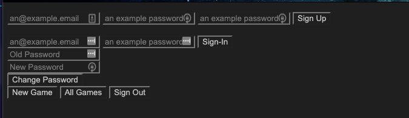

# Tic-Tac-Toe Project

#### This is a simple tic-tac-toe game using mostly  JavaScript. API used is from General Assembly

## I used Lucid Chart to create a wireframe for the landing page:

## Here's the final working result:

## User Stories:
I would like an easy way to reset the game
I would like the UI to be simple
I would like to be able to log in and out
I would like the app to work smoothly and consistently 
I would like to be able to keep track of my scores

## Planning: 
I started out going for core functionality with this project. I got seriously derailed when trying to refactor. My development process was trying to construct the HTML, then some light CSS for functionality. I added in Javascript to get the final product. 

## Future Enhancements / Unsolved Problems:
Color and style enhancements
advanced game recall features
One bug that I would like to fix is that the sign up and sign in forms don't hide when you un-hover over the button.

## Technologies:
* HTML
* CSS
* Vanilla JavaScript
* JQuery
* Lucid Chart
* General Assembly API
 

## Getting Started:
Click [HERE](https://crossronald.github.io/tic-tac-woah-project/) to open in desktop.

 